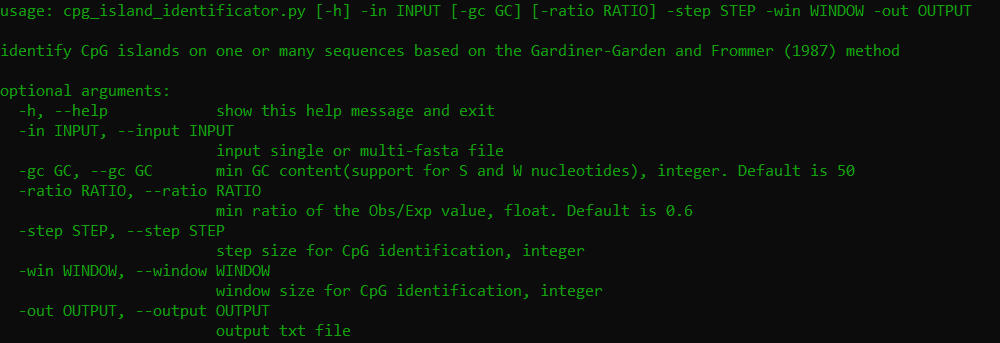
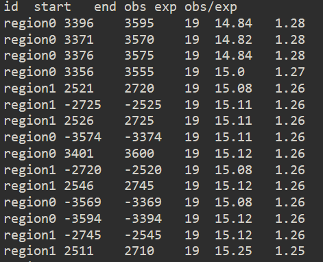

# CpG_island_identificator

CpG island identification pipeline inspired by the  Gardiner-Garden and Frommer (1987) method   
Windows grafical user interface standalone programs are avaliable here: 
for 1 single-fasta file:   
for many single-fasta files: 

 

# **Depedences**

1. python3.8 or later

2. argparse: `pip3 install argparse`  

3. biopython: `pip3 install biopython`

4. pandas: `pip3 install pandas`  

5. Gooey: (for the `gui.py` scripts) `pip install Gooey`
   
   # **Example code**
   
   With the following script CpG islands are identified by selecting the %GC content, Obs/Exp ratio  window and step size. In this example sequence the existence of CpG islands is checked on 200 bp windows with 1 bp interval(the window moves 1bp each time):                     
   `cpg_island_identificator.py -in test.fasta -out cpg_table.txt -win 200 -step 1 -gc 55.00 -ratio 1.0`
   This script can be run also as GUI by running: `python3 cpg_island_identificator_gui.py` and a window will pop up                                                      
   
   The output file will look like:   
   
