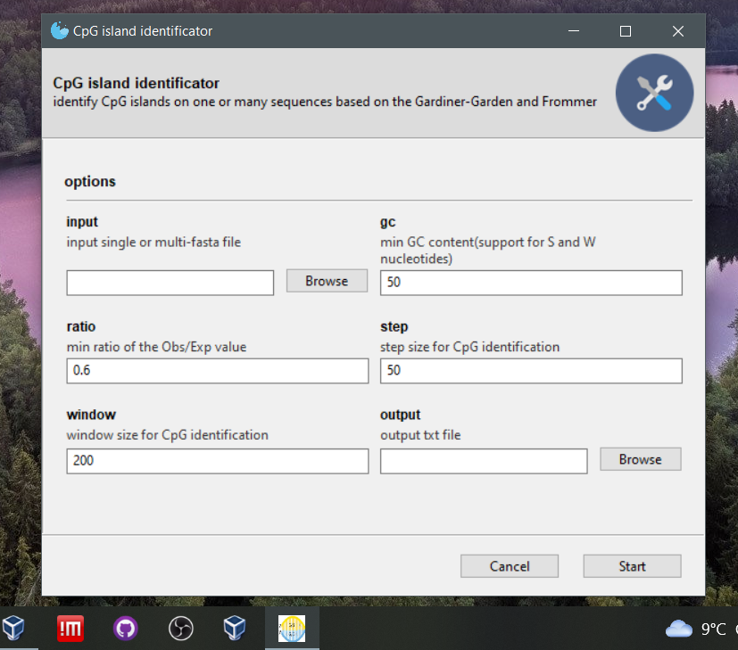

# CpG_island_identificator 

CpG island identification pipeline inspired by the  Gardiner-Garden and Frommer (1987) method 

# **Executable apps**

 

Windows and linux grafical user interface standalone programs and a linux command line program are avaliable here: 

# **Depedences**

1. python3.8 or later

2. argparse: `pip3 install argparse`(for the command line script)  

3. pyfaidx: `pip3 install pyfaidx`

4. pandas: `pip3 install pandas`  

5. Gooey: (for the `gui.py` script) `pip install Gooey`

# **Example code**

 With the following script CpG islands are identified by selecting the %GC content, Obs/Exp ratio  window and step size. In this example sequence the existence of CpG islands is checked on 200 bp windows with 50 bp interval(the window moves 50bp each time):  
`python3 cpg_island_identificator.py -in test.fasta -out cpg_table.txt -win 200 -step 50 -gc 55.00`  
This script can be run also as GUI by running:   
`python3 cpg_island_identificator_gui.py` and a window will pop up

The output file will look like: 

