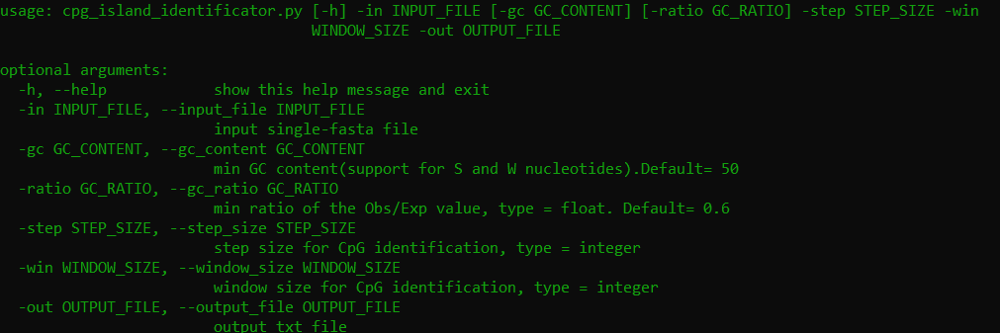

# CpG_island_identificator 
CpG island identification pipeline inspired by the  Gardiner-Garden and Frommer (1987) method   
A windows stadalone executable is avaliable here: 

 
# **Depedences**
1. python3.8 or later
2. [bioconda](https://bioconda.github.io/user/install.html) 
3. argparse: `pip3 install argparse`  
4. biopython: `conda install biopython` (do not install with pip as it may have trouble recognising the imported packages)
5. pandas: `conda install pandas` (for the same reason as above)  
6. Gooey: (for the `gui.py` script) `conda install -c conda-forge gooey`
# **Example code**  
With the following script CpG islands are identified by selecting the %GC content, Obs/Exp ratio  window and step size. In this example sequence the existence of CpG islands is checked on 200 bp windows with 1 bp interval(the window moves 1bp each time):                     
`cpg_island_identificator.py -in test.fasta -out cpg_table.txt -win 200 -step 1 -gc 55.00 -ratio 1.0`
This script can be run also as GUI by running: `python3 cpg_island_identificator_gui.py` and a window will pop up                                                      
The output file will look like:  

# **Errors**   
The error that can arise if the calculations does not meet the createria of the user's thresholds is:   
`IndexError: single positional indexer is out-of-bounds `. If this error appears rerun the program with less strict parameters and it will work.